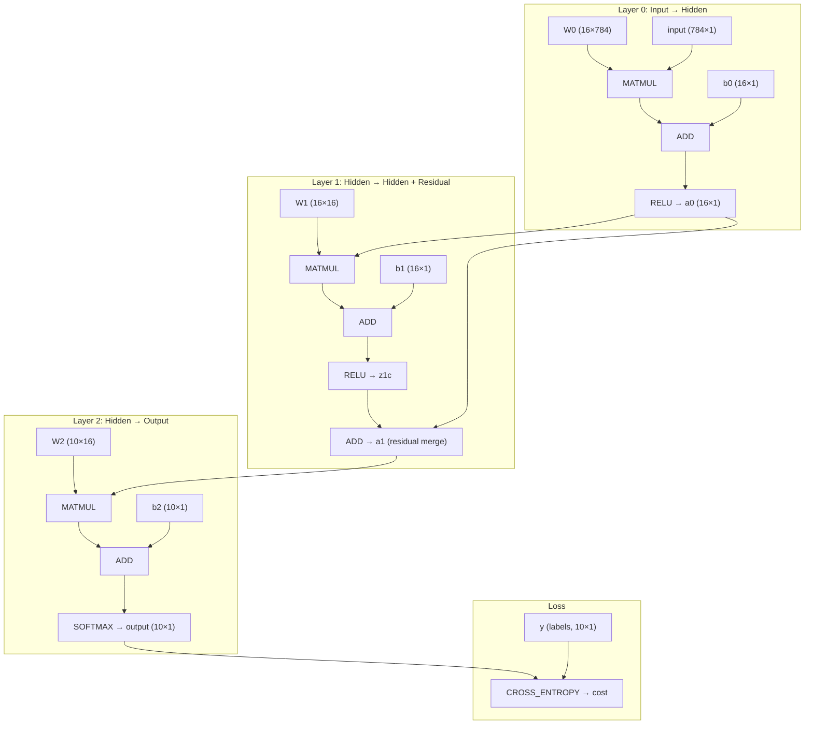

# The Computational Graph — A Worked Example

How a model is represented as a graph of `model_var` nodes, how the engine
executes it, and a full numeric forward + backward pass traced by hand through
the same operations the code performs.

## The MNIST graph

The network built by `create_mnist_model()` (784 → 16 → 16 → 10, with a
residual connection):



Every box is a `model_var` node holding a `val` matrix (and a `grad` matrix if
it requires gradients). Leaf nodes (`input`, `y`, `W*`, `b*`) are `CREATE`d with
values; op nodes store which operation produced them and their upstream nodes
in `inputs[2]`.

## How the engine runs it

1. **Build** — `mv_create` / `mv_matmul` / `mv_add` / ... allocate nodes and
   wire `inputs[]`. Every node is registered in `model_context.vars`.
2. **Compile** — `model_compile()` runs a DFS from a target node (`output` or
   `cost`) and flattens the graph into a `model_program`: a flat array of nodes
   in execution order, dependencies before dependents. Built once, reused for
   every pass.
3. **Forward** — `model_program_compute()` walks the array front to back and
   calls the matching `mat_*` function for each node's `op`.
4. **Backward** — `model_program_compute_grads()` clears non-parameter grads,
   seeds the cost node's grad with 1.0 (∂L/∂L = 1), then walks the array in
   reverse, distributing each node's grad into its inputs via the chain rule.
   All gradients **accumulate** (`+=`), which is what allows mini-batches.

## Worked example (tiny net, real numbers)

Same op types as the MNIST model, small enough to trace by hand:

```
x (2×1) → MATMUL(W,x) → ADD(+b) → RELU → MATMUL(V,a) → ADD(+c) → SOFTMAX → CROSS_ENTROPY(y)
```

Parameters and input:

```
x = [1, 2]ᵀ

W = [ 1   0 ]     b = [ 0.5]
    [-1   2 ]         [-1  ]

V = [ 1   -1]     c = [0]
    [ 0.5  1]         [0]

y = [0, 1]ᵀ   (true class = 1)
```

### Forward pass (what `model_program_compute` does)

| Step | Op | Code | Computation | Result |
|------|----|------|-------------|--------|
| z | MATMUL + ADD | `mat_mul`, `mat_add` | z₀ = 1·1 + 0·2 + 0.5, z₁ = −1·1 + 2·2 − 1 | z = [1.5, 2] |
| a | RELU | `mat_relu` | max(0, z) | a = [1.5, 2] |
| u | MATMUL + ADD | `mat_mul`, `mat_add` | u₀ = 1·1.5 − 1·2, u₁ = 0.5·1.5 + 1·2 | u = [−0.5, 2.75] |
| p | SOFTMAX | `mat_softmax` | see below | p = [0.03733, 0.96267] |
| L | CROSS_ENTROPY | `mat_cross_entropy` | −log(0.96267) | L = 0.03804 |

Softmax detail (subtracts the max first, for numerical stability):

```
max(u) = 2.75
exp(−0.5 − 2.75) = exp(−3.25) = 0.03877
exp(2.75 − 2.75)  = 1
p = [0.03877, 1] / 1.03877 = [0.03733, 0.96267]
```

The prediction (class 1) matches the label, so the cost is small.

### Backward pass (what `model_program_compute_grads` does)

Seed: `cost->grad = 1`. Then reverse through the program, each op distributing
grad into its inputs.

**Cross-entropy** (`mat_cross_entropy_add_grad`): q_grad = −y/p · grad

```
grad_p = [0, −1/0.96267] = [0, −1.03877]
```

**Softmax** (`mat_softmax_add_grad`): full Jacobian J, where J[i,j] = pᵢ(δᵢⱼ − pⱼ)

```
J = [ 0.03593  −0.03593]
    [−0.03593   0.03593]

grad_u = J · grad_p = [0.03733, −0.03733]
```

Note the result equals **p − y** — the famous softmax + cross-entropy
simplification, emerging here from the full Jacobian the code actually computes.

**u = V·a + c** splits at the ADD (grad flows to both inputs equally), then the
MATMUL (`mat_mul` with transpose flags):

```
grad_V = grad_u · aᵀ = [ 0.05599   0.07465]
                       [−0.05599  −0.07465]
grad_c = grad_u      = [0.03733, −0.03733]
grad_a = Vᵀ · grad_u = [1·0.03733 + 0.5·(−0.03733),  −1·0.03733 + 1·(−0.03733)]
                     = [0.01866, −0.07465]
```

**ReLU** (`mat_relu_add_grad`): pass grad only where z > 0 — both are, so
`grad_z = grad_a` unchanged.

**z = W·x + b**:

```
grad_W = grad_z · xᵀ = [ 0.01866   0.03733]
                       [−0.07465  −0.14931]
grad_b = grad_z      = [0.01866, −0.07465]
```

### Parameter update (what `model_train` does)

With learning rate η = 0.1 and a batch size of 1:

```
W ← W − 0.1 · grad_W = [ 0.99813  −0.00373]
                       [−0.99253   2.01493]
```

In real training the grads accumulate over 50 samples and are scaled by
η/batch_size before this subtraction.

## Gradient rules reference

| Op | ∂L/∂a | ∂L/∂b |
|----|-------|-------|
| `ADD` | `+= grad` | `+= grad` |
| `MATMUL` (a·b) | `+= grad · bᵀ` | `+= aᵀ · grad` |
| `RELU` | `+= (a > 0) ? grad : 0` | — |
| `SOFTMAX` | `+= J · grad` (Jacobian above) | — |
| `CROSS_ENTROPY` (p, q) | `+= −log(q) · grad` | `+= −p/q · grad` |
